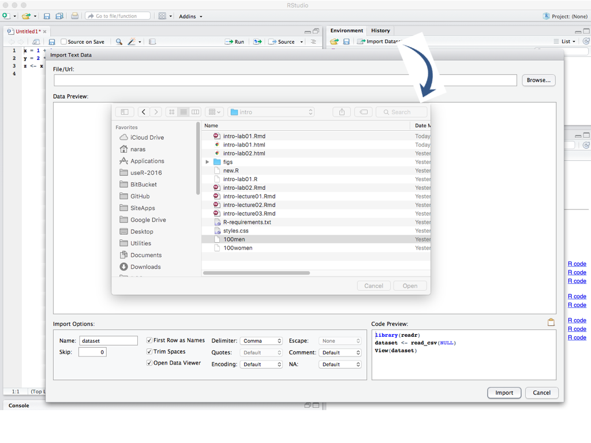

## Datasets

R comes with many datasets built in. These are part of the `datasets`
package that is always loaded in R. For example, the `mtcars` dataset
is a well-known dataset from Motor Trend magazine, documenting fuel
consumption and vehicle characteristics for a number of vehicles. At
the R console, typing `mtcars` will print the entire dataset.

You can find help on datasets as usual using the _Help_ tab in
RStudio, clicking on the `Packages` link and navigating to the
`datasets` package.

## Import data

To do any real work, one has to load data from an external
source. RStudio makes it easy to import data.

Consider the data set that will be used in Lab 2, which is the 100m
times for men and women. We will illustrate importing this data set,
step by step.

### Step 1

From the _Import Dataset_ menu, select _From CSV_ to get a dialog as
shown below and navigate to the folder containing the `100men` file.



Note that the import dialog has a number of options and on the right
buttom it shows a preview of the code that will be used to import the
data. If one cut and pasted the code into the R console, the result
would be the same as what one would get via the dialogs.

RStudio also take care to name the variable that will hold data
according R conventions using `X100men`!

### Step 2

When you open the file, RStudio shows a preview of the data in the
viewer window.


This is of course not what we want since a cursory inspection shows
that the data appears to contain three columns. So obviously, we have
specified something wrong.

### Step 3

In the _Import Options_ panel, change the delimeter to `Tab` and while
we are at it, change the name to `data.men`.  Notice how the code
preview reflects changes made to these options.


### Step 4

Press the _Import_ button to get the data into R.


The result of the import is a variable called `data.men` that contains
the data. Data formatted this way (either tab-delimeted, or
comma-separated, or spread-sheet like) is so common that R has a
abstraction for it: the _data frame_. You will have more opportunity
to learn about data frames in the data parts of the course.

### Avoiding dialogs

As one becomes more and more familiar with R, direct code becomes
preferable to the slower interactive dialogs. This is one reason that
RStudio gives you the code preview, to aid in your learning
process. So, to get the same effect as the above dialog process did,
one could have pasted the RStudio code into an R console to get the
same result.

```{r}
library(readr)
data.men <- read_delim("100men", "\t", escape_double = FALSE, trim_ws = TRUE)
```

That would create the same data set.

With more complex structures like data frames, the function `str` (for
structure) is a good way to examine them.

```{r}
str(data.men)
```
We see that the data consists of 20 observations on 3 variables:
`Athlete`, `Time`, `Date`. The second is numeric while the others are
character.


### More on data import

RStudio provides ways to import data directly from spreadsheets like
Excel, etc. You can explore these options on your own.

RStudio makes use of some packages to import data, notably the `readr`
package. Strictly speaking these packages are not necessary for the
job, but such packages include improvements that make them
attractive. For example, a vanilla installation of R provides
functions like `read.csv` and `read.delim` (analogous to `read_csv`,
`read_delim`) that can also be used. However, by default, these
functions perform some conversions, treating character variables as
factors, for example. That can be troublesome (and computationally
expensive) when dealing with large data sets. In this class, some
instructors may use these vanilla R functions with various options to
control the behavior.

## Graphs and Plots

Graphing/plotting are among the great strengths of R. There are
two main  main approaches that are common in building graphs and
plots.

1. Using basic functions provided by R itself via the `graphics`
package which has a number of standard facilities. A quick way to
familiarize yourself with base graphics is to type the command
`demo(graphics)` at the R console to see its capabilities.

2. Using a package like `ggplot2`, which requires a more nuanced
   understanding of a graphics object. You will have to install this
   package. `ggplot2` implements a grammar of graphics and so takes a
   bit more work to use, but is quite powerful.

Both approaches allow for step-by-step building up of complex plots,
and creating PDFs or images that can be included in other documents.
Although `ggplot2` is becoming more popular, many packages may not use
`ggplot2` for plotting. Furthermore, some special plots created by
packages may use one of base graphics or `ggplot2` and so there isn't
a ready made equivalent in the other, although it can be constructed
with extra work. So you will see both bae graphics and `ggplot2` used
in this course.

For ease of use, `ggplot2` provides a function called `qplot` that can
emulate the base graphics `plot` function capabilities. This offers a
quick way to begin using `ggplot2`, initially.


|Description |Base Graphics | `ggplot2`|
|------------|--------------|----------|
|Plot `y` versus `x` using points| `plot(x, y)`| `qplot(x, y)`|
|Plot `y` versus `x` using lines | `plot(x, y, type = "l")`|`qplot(x,
|y, geom = "line")`|
|Plot `y` versus `x` using both points and lines | `plot(x, y, type =
|"b")`|`qplot(x, y, geom = c("point", "line"))`|
|Boxplot of `x`| `boxplot(x)`| `qplot(x, geom = "boxplot")`|
|Side-by-side boxplot of `x` and `y`| `boxplot(x, y)`| `qplot(x, y, geom = "boxplot")`|
|Histogram of `x`| `hist(x)`| `qplot(x, geom = "histogram")`|


#### Examples

It is a good idea to try out the functions using the `example`
function. At the R console type,

```{r, eval = FALSE}
example(plot)
```
to see the `plot` examples.

For `ggplot2`, you will have to load the library first and then use
`example`.

```{r, eval = FALSE}
library(ggplot2)
example(qplot)
```
